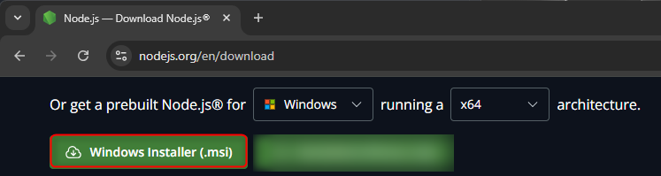
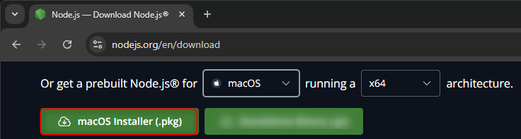
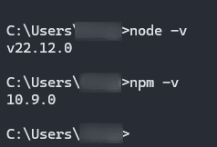
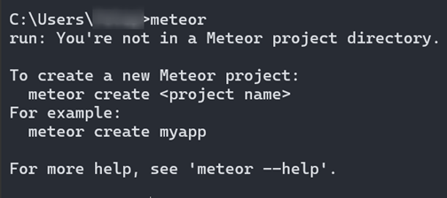

# Binder

Binder is a web application project created for the Software Engineering Course in HES-SO Valais-Wallis third ISC semester program.

With Binder, users can effortlessly browse a curated selection of available titles, each accompanied by a brief recommendation, a mini book description, and a personalized fit index to help match readers with their ideal books.

Users have the flexibility to manage their reading choices, including the ability to return books before the booking period ends and access a history of their past bookings. Additionally, users can track their reading statistics on a dedicated stats page.

For administrators, Binder offers comprehensive tools to oversee the book collection. Admins can add, remove, hide, and search for titles, as well as analyze user interactions through detailed statistics for both individual users and the overall book collection.

## Requirements

* Node.js
* Meteor

## Installation steps

To launch the Binder web application, follow these steps.

### Installing Node.js
Download and install Node.js from the official website

👉 https://nodejs.org/en/download/

#### Windows


#### macOS


#### Checking Node.js installation
After installation, verify Node.js and npm versions by running the following commands in a terminal.

```bash
node -v
npm -v
```



### Installing Meteor
To install Meteor, run the following command in the terminal.
```bash
npm install -g meteor
```


#### Checking Meteor installation
Once installed, check if Meteor is working by running the following command in the terminal.

```bash
meteor
```



### Cloning the GitHub Repository
Clone the Binder GitHub repository using the following command.

⚠️ Clone only in local folder, for example, it won't work with OneDrive directory.

```bash
git clone https://github.com/NathanAnto/binder-genielogiciel
```

### Installing Meteor packages
#### Manually
To run the application, the user needs to install packages like `react-d`, `@babel/runtime`, etc.

To do it manually, type following command for each package.
```bash
meteor npm install --save package_name
```

#### Automatically
To do it automatically, type the following command.

```bash
meteor npm install
```

### Launch the project
Launch the project using the following command in the project directory which contains the `.git` and `.meteor` files.

```bash
npm start
meteor
```

### Access the web page

Open a web browser and type `https://localhost:3000`

## More details

More details and the user guide can be found in the `binder-user-guide.pdf` document.


# Authors
- [NathanAnto](https://github.com/NathanAnto)
- [mariethoz](https://github.com/mariethoz)
- [VinceCor](https://github.com/VinceCor)
- [UnalKulekci](https://github.com/UnalKulekci)
- [fylis](https://github.com/fylis)
